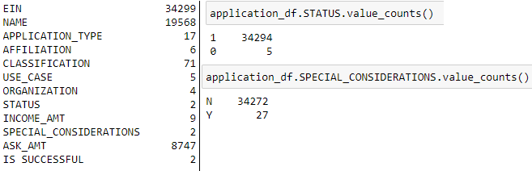
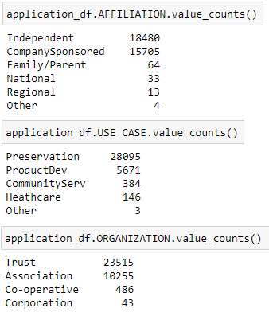
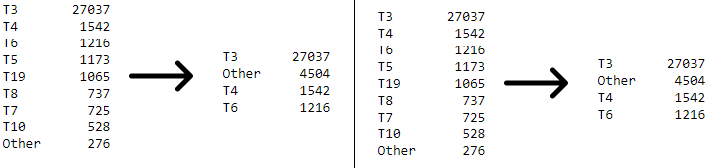
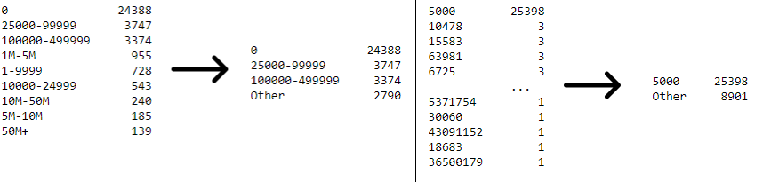
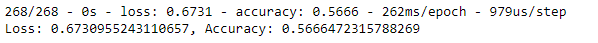
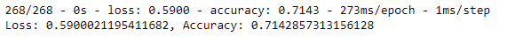
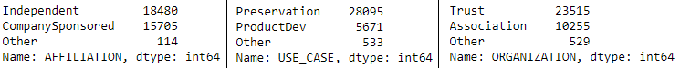
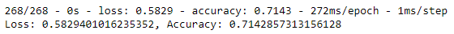

# Neural Network Charity Analysis Challenge

## Overview
This is a loan protection risk analysis. We are looking at a dataset containing the individuals and organizations (and their information) that have received funding from Alphabet Soup in the past. Using this data, we want to create a binary classifier we can use to predict whether potential future applicants will have success if they are chosen for funding.

## Results
##### Data Preprocessing

- IS_SUCCESSFUL is our target variable. We want to find our successful applicants and see if there are any predictable commonalities that led to their success.

- Initially, only the EIN and NAME identification columns were removed, because they were obvious extraneous features that would not add anything of value to our model.

- Additionally, I chose to remove the STATUS and SPECIAL_CONSIDERATIONS columns. I removed them because they each only had two unique values, and upon looking at them, there was nowhere near an even split between them. When we already have so many features, I thought they would create confusion for the model, not remove it. Also, whether the application is active or inactive is not relevant when we are specifically looking at past applications for the sake of predicting future predictions.

- I think arguments can be made as to whether AFFILIATION, ORGANIZATION, and USE_CASE are features or not. I think they present some potential redundancy when all included and with the other columns. However, considering we are looking at funding organizations, I think the information these columns contain is important, and should not be dismissed so casually, even when the data is not as much comparatively.

- The AFFILIATION and USE_CASE columns also already have an "Other" category, so it would be simple to bin the lower value items into the preexisting category. As previously stated, though, considering our intention, I am not sure it is wise shove so much of data into "Other" categories.

- Since the inclusion of these columns made little impact on my model, and made minimal impact regardless of whether additional binning was made or not, I decided to leave them in.

- The remaining features, APPLICATION_TYPE, CLASSIFICATION, INCOME_AMT, and ASK_AMNT are the most important feature variables for the model.

##### Compiling, Training, and Evaluating the Model

- The model initially ran with two hidden layers, with 80 in the first layer and 30 in the second, and ran at 100 epochs. With this default, the model had 72% accuracy with a 57% loss. The target goal is 75%.

- In an attempt to optimize the model and reach 75% accuracy, I did several things. The first of which was to increase the bin values for the APPLICATION_TYPE and CLASSIFICATION bins we already had. For applications, I made it so each category had no less than 1,000 values. For classifications, it is no less than 2,000. I wanted each to have four categories, so there were fewer for the model to concern itself with.

- I also binned the INCOME_AMT and ASK_AMT columns, on the left and right respectively. I wanted to separate incomes of over a million dollars and the rest. This also ended up catching incomes between 1 and 24,999, but I thought ensuring everything above million was put into "Other" was more important.  For ASK_AMT, since there were 8,747 different ask amounts and the overwhelming majority was for 5,000, I decided to simplify it to just 5,000 and "Other".

- As mentioned previously, I removed the SPECIAL_CONSIDERATIONS and STATUS columns as features.

- Finally, I added an additional hidden layer to the model, and distributed neurons as follows: 100, 40, 15. I kept the activation for the hidden layers "relu" and also increased the epochs from 100 to 150.

- These four factors were kept consistent across the following attempts.

- I did make some other attempts with more neurons and/or a "sigmoid" activation instead of the "relu" activation, but these did not produce significant differences for me. More epochs resulted in greater loss and more neurons made no discernible difference, either. With this in mind, I decided to up the computational power from the default, but keep my numbers on the lower side.

- I removed the AFFILIATION, USE_CASE, and ORGANIZATION columns in case they were adding too much noise and confusion to the model. This resulted in less accuracy and more loss.

- I also made an attempt where I binned the aforementioned columns. The accuracy was on par with the default attempt, but with slightly more loss. How they were binned is shown below. I wanted the two categories with the most, and then everything else.

- Finally, we have what I went with for my final result, which is composed of the updated binning to the APPLICATION_TYPE and CLASSIFICATION columns, the INCOME_AMT and ASK_AMT binning, the dropped SPECIAL_CONSIDERATIONS and STATUS columns, and the updated model itself. It peformed best out of these three, but still was worse than the initial model, and nowhere near 75%.

## Summary
My results tell me that the issue with the model is somewhere in the compiling and training phase. If I can make so many drastic changes in the preprocessing phase and all of it has little bearing on the model, the answer must lie elsewhere. In this case, the neural network itself.

However, even when I experimented with more neurons and different activation the results were not any better. I added an additional hidden layer, making it three hidden layers, but maybe more are needed? More hidden layers will increase the considerations between our variables. Maybe with the amount of features we have, that is exactly what we need.

So, going forward, before moving on to a different model, I think more tweaking should be done to the neural network, adding another hidden layer or two, and playing with the neuron distribution to see if we really cannot get the accuracy any higher.

Failing that, I suggest giving a Random Forest Model a shot at the data too. I suggest this because it is a robust model that combines multiple smaller models in order to make a classification. When considering the amount of features we have, the number of unique values within those features, and our goal, I think multiple smaller models might be exactly what we need. Especially considering that this model did worse when I removed features. A Random Forest Model might do a better job of accommodating the features and how they interact, including features that are seemingly similar or redundant, but provide crucial distinctions when it comes to identifying where our funding is actually going.
